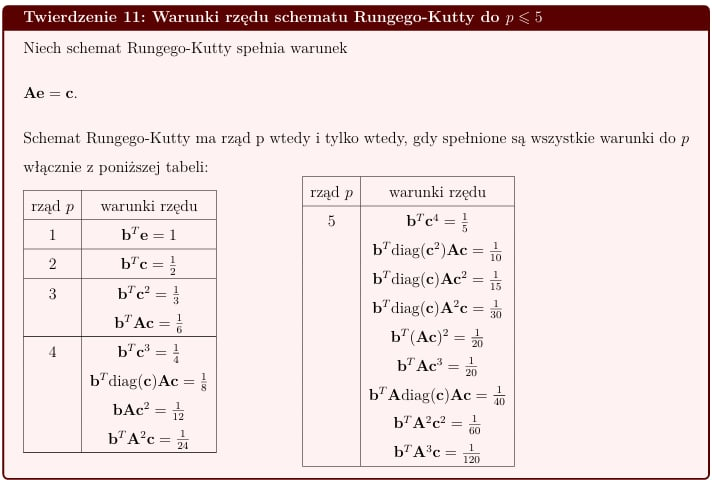
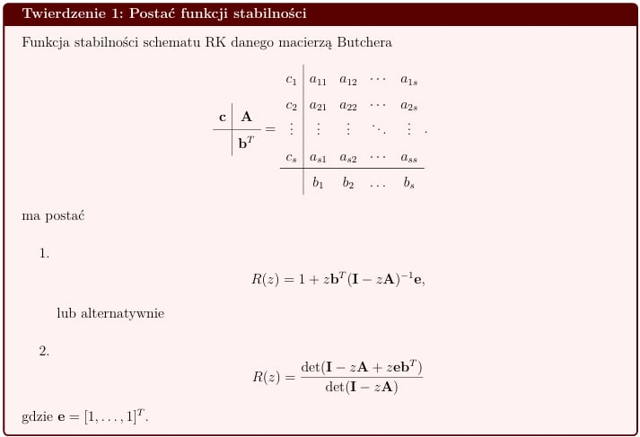
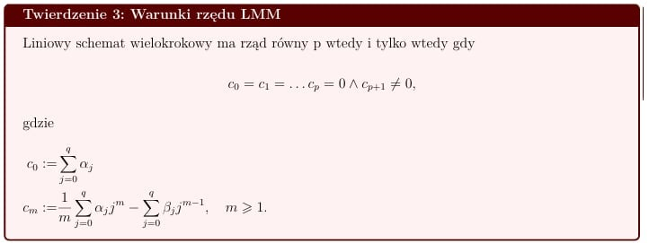
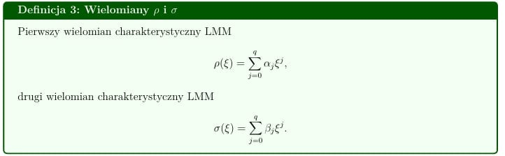

```{r setup, include=FALSE}
knitr::opts_chunk$set(echo = TRUE, warning = FALSE, message = FALSE)
```

Ładowanie bibliotek:

```{r}
library(deSolve)
library(ggplot2)
library(dplyr)
```

Celem projektu jest analiza wybranych schematów numerycznych - 4 -
etapowego schematu Rungego -Kutty (RK4) oraz 3-krokowego schematu
Adamsa - Bashfortha (AB3). Zbadamy rzędy oraz obszary absolutnej
stabilności tych schematów. W kolejnej części projektu przedstawimy
nieliniowy problem początkowy - równanie Trachenko - Zaccone. To
równanie wykorzystamy do porównania jego wyników z rozwiązaniami
wcześniej wybranych schematów. Wyznaczymy numeryczny rząd wybranych
schematów metodą połowienia kroków. W końcowej części przeanalizujemy
zachowanie metody dla układu równań liniowych jednorodnych, przy różnych
krokach czasowych względem obszaru stabilności.

# 4 - etapowy Schemat Rungego - Kutty (RK4)

Przypomnijmy ogólną definicję schematu Rungego - Kutty:

**Definicja:** s-etapowym ***schematem Rungego–Kutty*** nazywamy schemat
jednokrokowy postaci:
$$ x_{k+1} = x_{k} + h \sum_{i=1}^{s} b_{i} K_{i}, $$\
gdzie $$ K_{i} = f(t_{k}+c_{i}h, x_{k}+h \sum_{j=1}^{s} a_{ij}K_{j}) $$
dla $i \in \{1, \dots, s\}$.

Parametry powyższego schematu możemy zebrać w wektory oraz w macierze:

$$
A = \begin{bmatrix} a_{11} & \cdots  & a_{1s} \\ \vdots & \ddots & \vdots  \\ a_{s1} & \cdots  & a_{ss} \end{bmatrix}
\quad 
b =\begin{bmatrix} b_{1} \\\vdots \\b_{s}\end{bmatrix}
\quad
c =\begin{bmatrix}c_{1} \\\vdots \\c_{s}\end{bmatrix}
$$

Możemy zapisać schemat w macierzy blokowej (tzw.**macierzy Butchera**):

<center></center>

W dalszej części użyjemy jeszcze wektora zbudowanego z jedynek: $$
e = 
\begin{bmatrix}
1 \\
\vdots \\
1
\end{bmatrix}
$$

## Postać schematu 

My zajmiemy się 4-etapowym schematem Rungego Kutty:
$$ y_{n+1}=y_{n}+\frac{1}{6}h(K_{1}+2K_{2}+2K_{3}+K_{4}),$$ gdzie:
$$K_{1}=f(t_{n},y_{n}),$$
$$K_{2}=f(t_{n}+\frac{1}{2}h,y_{n}+\frac{1}{2}hK_{1}),$$
$$K_{3}=f(t_{n}+\frac{1}{2}h,y_{n}+\frac{1}{2}hK_{2}),$$
$$K_{4}=f(t_{n}+h,y_{n}+hK_{3}).$$ Przedstawiamy parametry schematu w
postaci wektorowej i macierzowej:

```{r}
A = matrix(c(0,0.5,0,0,
             0,0,0.5,0,
             0,0,0,1,
             0,0,0,0), nrow = 4 , byrow = FALSE)

b = c(1/6,2/6,2/6,1/6)

c = c(0,1/2,1/2,1)

e = c(1,1,1,1)

jednostkowa = matrix(c(1,0,0,0,
             0,1,0,0,
             0,0,1,0,
             0,0,0,1), nrow = 4 , byrow = FALSE)

```

## Analiza rzędu schematu RK4

Wyznaczymy rząd 4 - etapowego schematu Rungego - Kutty, za pomocą
twierdzenia, które zostało podane w wykładzie nr 8.

<center></center>

Sprawdzamy czy zachodzi warunek początkowy, czyli czy $Ae = c$. Jeśli
nie jest spełniony, nie będziemy mogli użyć powyższego twierdzenia.
Zaznaczmy, że oprócz sprawdzenia, czy równość jest prawdziwa, to
upewniamy się jeszcze, czy dane działanie jest możliwe do wykonania, np.
mnożenie macierzy.

```{r}
if(ncol(A) == length(c) && all(A %*% e == c)){
  print("Równość Ae = c jest prawdziwa")
} else {
  print("Równość Ae = c nie zachodzi")
}

```

Warunek zachodzi, zatem sprawdzamy warunki rzędu naszego schematu
jednokrokowego. Zaczynamy dla $p=1$:

```{r}
if(length(b) == length(e) && round(as.numeric(t(b) %*% e),digits = 2) == 1){
  print("Rząd tego schematu wynosi co najmniej 1")
} else {
  print("Rząd tego schematu nie jest równy 1")
}
```

Teraz sprawdzamy, czy rząd naszego schematu może być równy $2$:

```{r}
if(length(b) == length(c) && round(as.numeric(t(b) %*% c),digits = 2) == 0.5){
  print("Rząd tego schematu wynosi co najmniej 2")
} else {
  print("Rząd tego schematu nie jest równy 2")
}
```

Następnie sprawdzamy dla $p=3$:

```{r}
if(length(b) == length(c) && 
   round(as.numeric(t(b) %*% (c * c)), digits = 2) == round(1/3, digits = 2) && 
   length(b) == nrow(A) && 
   ncol(A) == length(c) &&
   round(as.numeric(t(b) %*% A %*% c),digits = 7) == round(1/6, digits = 7)){
  print("Rząd tego schematu wynosi co najmniej 3")
} else {
  print("Rząd tego schematu nie jest równy 3")
}
```

W dalszej części sprawdzamy, czy rząd naszego schematu będzie równy $4$:

```{r}
if(length(b) == length(c) && 
   round(as.numeric(t(b) %*% (c*c*c)), digits = 2) == 0.25 && 
   length(b) == nrow(A) && 
   ncol(A) == length(c) &&
   round(as.numeric(t(b) %*% diag(c) %*% A %*% c),digits = 3) == 1/8 &&
   round(as.numeric(t(b) %*% A %*% (c*c)), digits = 3) == round(1/12, digits = 3) &&
   round(as.numeric(t(b)%*%A%*%A %*% c), digits = 3) == round(1/24, digits = 3)){
  print("Rząd tego schematu wynosi co najmniej 4")
} else {
  print("Rząd tego schematu nie jest równy 4")
}
```

Teraz wskażemy warunek, który nie jest spełniony, by rząd naszego
schematu wynosił 5:

```{r}
if(length(b) == length(c) && round(as.numeric(t(b) %*% (c*c*c*c)),digits = 2) == 0.2){
  print("Rząd tego schematu wynosi co najmniej 5")
} else {
  print("Rząd tego schematu nie jest równy 5")
}
```

Reasumując, na podstawie przedstawionego wyżej twierdzenia, rząd 4 -
etapowego schematu Rungego - Kutty jest równy 4.

## Obszar absolutnej stabilności

Wyznaczamy funkcję stabilności tego schematu, na podstawie poniższego
twierdzenia, które również pojawiło się w wykładzie nr 8:

<center></center>

Korzystając z pierwszego wzoru na funkcję stabilności, otrzymujemy:

$$ 1 + z b^{T} (I - zA)^{-1} e = \frac{1}{24}z^{4} + \frac{1}{6}z^{3} + \frac{1}{2}z^{2} + z + 1.$$
Implementujemy wyżej podaną funkcję stabilności schematu RK4 w celu
przedstawienia obszaru absolutnej stabilności 4 - etapowego schematu
Rungego - Kutty.

```{r}
  f_stabilnosci <- function(z){
    return(1+z+0.5*z^(2)+1/6*z^(3)+1/24*z^(4))
  }
```

```{r}
# definicja liczby zespolonej
liczba_zespolona <- function(x,y){
  return(complex(real = x,imaginary = y))
}

obszar_abs_stabilnosci <- function(f_stabilnosci, x_1, x_2, y_1, y_2, krok){
  
  # budowa ciągów do budowy liczb zespolonych
  siatka_x <- seq(x_1, x_2, length = krok)
  siatka_y <- seq(y_1, y_2, length = krok)
  
  # budowa siatek do rysunku
  siatka_x_abline <- seq(ceiling(x_1),floor(x_2), by = 0.5)
  siatka_y_abline <- seq(ceiling(y_1),floor(y_2), by = 0.5)
  
  # tworzenie liczb zespolonych
  Z <- outer(siatka_x, siatka_y, liczba_zespolona)
  
  # wyznaczamy obszar absolutnej stabilności
  obszar_interesujacy <- abs(f_stabilnosci(Z)) < 1
  # przedstawienie obszaru absolutnej stabilności na rysunku
  image(siatka_x, siatka_y, obszar_interesujacy,
        col = c("white","lightblue"),xlab = "Re(z)", ylab = "Im(z)", main = "Obszar absolutnej stabilności    metody RK4")
  abline(h = 0, v = 0, lty = 1)
  abline(h = siatka_x_abline, v = siatka_y_abline, col = 'grey', lty = 3)
  legend('topright', legend = c('Obszar absolutnej stabilności'),
         col = c("lightblue"), fill="lightblue")
  
}
obszar_abs_stabilnosci(f_stabilnosci, -4 , 4, -4, 4, 400)
```

# 3 - krokowy schemat Adamsa - Bashfortha (AB3)

**Definicja:** Ogólna postać liniowej metody wielokrokowej: $$
\sum_{j=0}^q \alpha_j x_{k+j} = h \sum_{j=0}^q \beta_j f_{k+j},
$$ gdzie $k \in\{0,1,...,N-q\},$ oraz $f_{k+j} := f(t_{k+j},x_{k+j})$,
$\alpha_{q} \neq 0,$ $\alpha_{0}^{2} + \beta_{0}^{2} > 0$.

## Postać schematu

Dla metody AB3 ($q=3$) mamy:

$$
x_{k+3} - x_{k+2} = h \left( \frac{5}{12}f_k - \frac{4}{3}f_{k+1} + \frac{23}{12}f_{k+2} \right).
$$

Współczynniki powyższego schematu są następujące:

$$
\begin{align*}
\alpha_0 &= 0, & \beta_0 &= \frac{5}{12}, \\
\alpha_1 &= 0, & \beta_1 &= -\frac{4}{3}, \\
\alpha_2 &= -1, & \beta_2 &= \frac{23}{12}, \\
\alpha_3 &= 1, & \beta_3 &= 0.
\end{align*}
$$

## Analiza rzędu schematu AB3

<center></center>

Rząd metody określamy przez współczynniki:
$$c_0 := \sum_{j=0}^q \alpha_j,$$
$$c_m := \frac{1}{m} \sum_{j=0}^q \alpha_j j^m - \sum_{j=0}^q \beta_j j^{m-1}, \quad m \geq 1.$$

Obliczymy współczynniki dla metody AB3:

$$
\begin{align*}
c_0 &= \sum_{j=0}^3 \alpha_j = 0 + 0 - 1 + 1 = 0, \\
c_1 &= \sum_{j=0}^3 \alpha_j j - \sum_{j=0}^3 \beta_j = (0\cdot0 + 0\cdot1 - 1\cdot2 + 1\cdot3) - \left(\frac{5}{12} - \frac{4}{3} + \frac{23}{12} + 0\right)=0, \\
c_2 &= \frac{1}{2}\sum_{j=0}^3 \alpha_j j^2 - \sum_{j=0}^3 \beta_j j = \frac{1}{2}(0 + 0 - 4 + 9) - \left(0 - \frac{4}{3} + \frac{46}{12} + 0\right)=0, \\
c_3 &= \frac{1}{3}\sum_{j=0}^3 \alpha_j j^3 - \sum_{j=0}^3 \beta_j j^2 = \frac{1}{3}(0 + 0 - 8 + 27) - \left(0 - \frac{4}{3} + \frac{92}{12} + 0\right)=0, \\
c_4 &= \frac{1}{4}\sum_{j=0}^3 \alpha_j j^4 - \sum_{j=0}^3 \beta_j j^3 = \frac{1}{4}(0 + 0 - 16 + 81) - \left(0 - \frac{4}{3} + \frac{184}{12} + 0\right)= \frac{9}{4} \neq 0. \\
\end{align*}
$$

$$
c_0 = c_1 = c_2 = c_3 = 0 \quad \text{oraz} \quad c_4 \neq 0,
$$ Z powyższych obliczeń wynika, że metoda AB3 ma rząd równy 3.

## Obszar absolutnej stabilności

<center></center>

Definiujemy również wielomian stabilności LMM:
$$\pi(\xi,z) = \sum_{j=0}^{q}\rho(\xi) - z\sigma(\xi).$$ Dla schematu
AB3 wielomiany $\rho(\xi)$ i $\sigma(\xi)$ przyjmują postać:

$$
\rho(\xi)=\xi^3-\xi^2,
$$

$$
\sigma(\xi)=\frac{23}{12}\xi^2-\frac{16}{12}\xi+\frac{5}{12}.
$$ Wykorzystamy je do wyznaczenia brzegu obszaru absolutnej stabilności.
Pierwiastki wielomianu $\pi(\xi,z)$ są funkcjami ciągłymi zmiennej $z$,
czyli $\xi_{s}(z)$. Zatem jeśli $z$ należy do brzegu obszaru absolutnej
stabilności, to jeden z pierwiastków równania $\pi(\xi,z)$ leży na kole
jednostkowym i taki pierwiastek również możemy zapisać jako:
$\xi_{s} = e^{i\theta}$ dla $\theta \in [0,2\pi)$. Wobec tego prawdą
jest, że
$\pi(e^{i\theta}) = \rho(e^{i\theta}) - z \sigma(e^{i \theta}) = 0$.
Ostatecznie:
$$z(\theta) = \frac{\rho(e^{i\theta})}{\sigma(e^{i\theta})}.$$

Dla schematu Adamsa - Bashfortha wnętrze brzegu jest obszarem absolutnej
stabilności tej metody.

```{r}
# implementacja wielomianów
sigmaAB3 <- function(z) {
  (23/12)*z^2 - (16/12)*z + (5/12)
}
rhoAB3 <- function(z){
  z^2*(z-1)
}

# funkcja do wyznaczenia brzegu obszaru absolutnej stabilności
brzegAB3 <- function(theta) {
  z <- exp(1i*theta) 
  sigma <- sigmaAB3(z)  
  rho<-rhoAB3(z)
  polAB3 <- rho/sigma  
  return(polAB3)
}


theta <- seq(0, 2*pi, length = 1000)
punkty_brzegowe <- sapply(theta, brzegAB3)

# Obszar absolutnej stabilności
plot(Re(punkty_brzegowe), Im(punkty_brzegowe), 
     type = "l", 
     xlab = "Re(z)", 
     ylab = "Im(z)", 
     main = "Obszar absolutnej stabilności metody AB3",
     xlim = c(-1, 0.5), 
     ylim = c(-1, 1))
polygon(Re(punkty_brzegowe), Im(punkty_brzegowe), col = "lightblue", border = NA)
abline(h = 0, v = 0, col = "black", lty = 2)
abline(h=seq(-2, 2, by=0.2), col = 'grey', lty = 3)
abline(v=seq(-2, 2, by=0.2), col = 'grey', lty = 3)
  legend('topright', legend = c('Obszar absolutnej stabilności'),
         col = c("lightblue"), fill="lightblue")
```

# Równanie Trachenko - Zaccone (TZ)

Jest to nieliniowe równanie różniczkowe pierwszego rzędu. Opisuje ono
kinetykę (czyli jak szybko zachodzą zmiany) procesów relaksacyjnych w
materiałach amorficznych (szkłach polimerowych, metalicznych,
dielektrykach), tzn. procesu powrotu z stanu niespokojnego do stanu
równowagi. Równanie to może opisywać np. proces stygnięcia herbaty w
kubku z temperatury $100$ stopni do $20$ stopni. Kubek stopniowo oddaje
ciepło, do momentu gdy będzie on miał temperaturę taką jak przed wlaniem
herbaty. Równanie TZ jest postaci:

$$\begin{align*}
&\frac{dy}{dt}= - \frac{y}{\tau}\exp(Ky),\\
&y(0)= 1,
\end{align*}$$

gdzie:

-   $y$ określa jak bardzo materiał jest "niespokojny", "ściśnięty",

-   $\tau$ to czas relaksacji (do momentu równowagi),

-   $K$ to parametr nieliniowości, który decyduje czy relaksacja jest
    wolna i równomierna ($K>0$ ), czy bardziej nagła ($K<0$).

# Porównanie rozwiązania referencyjnego i numerycznego

W tej części chcemy sprawdzić rozwiązanie referencyjne oraz
schematy RK4 i AB3 dadzą takie same, czy różne wyniki rozwiązań na
przedziale $[0,10]$. Ustalamy parametry dla równania TZ:
$\tau = 3, K = 2$.

```{r}
t0 <- 0
tn <- 10
tau<-3
K <- 2
y_0 <- 1
```

Implementujemy metody: 4 - etapowy schemat Rungego - Kutty oraz
3-krokowy schemat Adamsa - Bashfortha.

```{r}
RK4 <- function(f, y_0, t_0, t_N, N, tau, K) 
{
  t <- seq(t_0, t_N, length = N+1)
  h <- (t_N - t_0)/N
  y <- numeric(length(N+1))
  y[1] <- y_0
  for (i in 2:(N+1)){
    k_1 <- f(t[i-1],y[i-1], tau, K)
    k_2 <- f(t[i-1]+h/2, y[i-1]+h*k_1/2, tau, K)
    k_3 <- f(t[i-1]+h/2, y[i-1]+h*k_2/2, tau, K)
    k_4 <- f(t[i-1], y[i-1]+h*k_3, tau, K)
    y[i] <- y[i-1]+h*(k_1+2*k_2+2*k_3+k_4)/6
  }
  return(data.frame(t,y))
}


AB3 <- function(f, y_0, t_0, t_N, N, tau, K) {
  h <- (t_N - t_0)/N
  t <- seq(t_0, t_N, length= N+1)
  y <- numeric(length(N+1))
  
  y[1:3]<-RK4(f, y_0, t_0, t_0+2*h, 2, tau, K)$y
  for (i in 3:N) {
    y[i+1] <- y[i] + h/12*(23*f(t[i], y[i], tau, K) - 16*f(t[i-1], y[i-1], tau, K) + 5*f(t[i-2], y[i-2], tau, K))
  }
  return(data.frame(t, y))
}
```

Implementacja równania Trachenko - Zaccone.

```{r}


# implementacja równania do skorzystania z desolve do ode
trachenko_zaccone <- function(t, y, parms) {
  tau <- parms['tau']
  K <- parms['K']
  dydt <- -(y/tau)*exp(K*y)
  list(dydt)
}
# implementacja równania do dalszych obliczeń
f_tz <- function(t, y, tau, K) {
  return(-y/tau*exp(K*y))
}
```

Wyliczenie rozwiązań:

```{r}
parms <- c(tau = tau, K = K)
y_0 <- c(y_0 = y_0)
times <- seq(0, 10, length = 201) 
rozw_desolve <- ode(y = y_0, times = times, func = trachenko_zaccone, parms = parms)
rozw_rk4 <- RK4(f_tz, y_0, t_0 = 0, t_N = 10, N = 200, tau, K)
rozw_ab3 <- AB3(f_tz, y_0, t_0 = 0, t_N = 10, N = 200, tau, K)
```

Odpowiednie porównanie rozwiązań przedstawione na rysunku:

```{r}
plot(rozw_desolve[, 'time'], rozw_desolve[, 'y_0'], 
     type = 'l', col = 'black', lwd = 2,
     main = 'Porównanie rozwiązań równania Trachenko-Zaccone',
     xlab = 't', ylab = 'y(t)')
lines(rozw_rk4$t, rozw_rk4$y, col = 'blue', lwd = 2, lty=6)
lines(rozw_ab3$t, rozw_ab3$y, col = 'red', lwd = 2, lty=3)
legend('topright', 
       legend = c('referencyjne (desolve)', 'RK4', 'AB3'), 
       col = c('black', 'blue', 'red'), 
       lty = c(1, 6, 3), lwd = 2)
```

# Wyznaczenie numerycznego rzędu zbieżności metodą połowienia kroku

W tej części przeanalizujemy rzędy zbieżności wybranych metod. Wyliczamy
rozwiązanie referencyjne równania Trachenko - Zaccone. Do badania zachowania
rozwiązania numerycznego użyjemy następującej miary błędu:
$$err_{end} = \|x_{n} - x(T)\| .$$Jest to norma różnicy między
rozwiązaniem numerycznym w końcowym punkcie siatki, a wartością
rozwiązania referencyjnego na końcu przedziału.

```{r}
rozw_ref <- ode(y = y_0, times = seq(t0, tn, length = 1001), func = trachenko_zaccone,
               parms = c(tau=tau, K=K))
```

```{r}
error_end <- function(N, metoda) {
  h <- (tn - t0)/N
  if (metoda =='RK4') {
    rozw <- RK4(f_tz, y_0, t0, tn, N, tau, K)
  } else if (metoda== 'AB3') {
    rozw <- AB3(f_tz, y_0, t0, tn, N, tau, K)
  }
  y_end <- rozw$y[N+1]
  y_ref <- rozw_ref[nrow(rozw_ref), 2] #ostatni wiersz drugiej kolumny
  abs(y_end - y_ref)
}
```

Tworzymy ciąg liczby kroków $N=5\cdot2^k$

```{r}
k <- 10
N_lista <- 5*2^(1:k)
```

Obliczanie błędów dla schematów RK4 i AB3:

```{r}
err_RK4 <- sapply(N_lista, error_end, metoda = "RK4")
err_AB3 <- sapply(N_lista, error_end, metoda = "AB3")
```

Tworzymy ilorazy błędów $\frac{err_N}{err_{2N}}$, po których możemy
zobaczyć, czy rzeczywiście błąd szybko maleje, jeśli zmniejszamy krok
$h$ o połowę.

```{r}
iloraz_RK4 <- numeric(length(err_RK4)-1)  
for (i in 1:(length(err_RK4)-1)) {
  iloraz_RK4[i] <- err_RK4[i]/err_RK4[i+1]
}
iloraz_RK4_1<-log2(err_RK4[1])

iloraz_AB3 <- numeric(length(err_AB3)-1)  
for (i in 1:(length(err_AB3)-1)) {
  iloraz_AB3[i] <- err_AB3[i]/err_AB3[i+1]
}
iloraz_AB3_1<-log2(err_AB3[1])

p_RK4 <- log2(iloraz_RK4)
p_AB3 <- log2(iloraz_AB3)
```

Tabela wyników:

```{r}
tabela <- data.frame(
  N = N_lista,
  h = (tn - t0)/N_lista,
  err_RK4 = err_RK4,
  p_RK4 = c(iloraz_RK4_1,p_RK4),
  err_AB3 = err_AB3,
  p_AB3 = c(iloraz_AB3_1,p_AB3)
)

print(tabela)
```

Wykresy log-log

```{r}
ggplot(tabela, aes(y = err_AB3, x = h)) +
  geom_point()+ 
  geom_line(aes(y = err_AB3[1]*(h/h[1])^3), color = "red", linetype = "dashed") +
  scale_x_log10()+
  scale_y_log10()+
  labs(title = "Wykres log-log dla AB3") +
  theme_minimal()

ggplot(tabela, aes(y = err_RK4, x = h)) +
  geom_point()+ 
  geom_line(aes(y = err_RK4[1]*(h/h[1])^4), color = "red", linetype = "dashed") +
  scale_x_log10()+
  scale_y_log10()+
  labs(title = "Wykres log-log dla RK4") +
  theme_minimal()
```

Zauważamy, że metoda połowienia kroku potwierdza nasze wcześniejsze
obliczenia (dokładnie z tego, że
$p = log_{2}(\frac{err_{N}}{err_{2N}})$), tzn. schemat RK4 ma rząd równy
4, a AB3 ma rząd równy 3.

# Analiza stabilności metod numerycznych na układzie liniowym

Rozważmy układ równań różniczkowych zwyczajnych o stałych
współczynnikach postaci: $$
\begin{cases}
x'(t) = \mathbf{A} \, x(t) \\
x(0) = x_0
\end{cases},
$$ gdzie

$$
\mathbf{A} = 
\begin{bmatrix}
-\frac{1}{5} & -1 \\ 
1 & -\frac{1}{5}
\end{bmatrix},
\quad
x_{0} = 
\begin{bmatrix}
2 \\
3
\end{bmatrix}, \ \ \lambda=-\frac{1}{5}\pm i.
$$ 
Rozwiązaniem układu jest 
$$
x(t) = e^{\mathbf{A}t}x_{0}=
\begin{bmatrix}
e^{-\frac{1}{5}}(2\cos(t)-3\sin(t)) \\ 
e^{-\frac{1}{5}}(2\cos(t)+3\sin(t))
\end{bmatrix}.
$$

Naszym celem jest znalezienie za pomocą metody bisekcji długości
granicznej kroku $h_{gran}>0$, aby $|R(\lambda\cdot h_{gran})| = 1$, z
wykorzystaniem funkcji stabilności odpowiedniego schematu. Wykorzystamy
to do zbadania stabilności numerycznego rozwiązania w zależności od
$h \in \{h_{gran},h_{gran}\cdot 1.1, h_{gran}\cdot 1.5, h_{gran}\cdot 0.9, h_{gran}\cdot 0.5, h_{gran}\cdot 0.2\}$.

```{r}
# Nasze dane
A <- matrix(c(-1/5,1, -1, -1/5), nrow = 2, byrow = FALSE)
x_0 <- c(2,3)
t_0 <- 0 
t_N <- 50

```

Zaimplementujemy nieco poprawiony 4 - etapowy schemat Rungego - Kutty.

Najpierw wyznaczamy długość graniczną kroku $h_{gran}>0$, z wykorzystaniem
funkcji stabilności schematu RK4.

```{r}
# budowanie wartości własnej
liczba_zespolona <- function(x,y){
  return(complex(real = x,imaginary = y))
}
wartosc_wlasna <- liczba_zespolona(-1/5,-1) 

f_stabilnosci <- function(z){
  return(1+z+0.5*z^(2)+1/6*z^(3)+1/24*z^(4))
}

f_celu <- function(h, f_stabilnosci, wartosc_wlasna){
  z <- wartosc_wlasna * h
  abs(f_stabilnosci(z)) - 1
}

# szukamy wartości startowych
wartosci_startowe <- function(h,f_stabilnosci, wartosc_wlasna,f_celu){
  a <- f_celu(h,f_stabilnosci, wartosc_wlasna)
  if(a > 0){
    h1 <- 1
    h2 <- 1e-6
  }else{
    h2 <- 1
    i <- 0
    h1 <- 2^{i}
    while(f_celu(h1,f_stabilnosci, wartosc_wlasna) < 0){
      i <- i+1
      h1 <- h1 * 2
    }
  }
  return(c(h1, h2))
}


h1 <- wartosci_startowe(1,f_stabilnosci, wartosc_wlasna, f_celu)[1]
h2 <- wartosci_startowe(1,f_stabilnosci, wartosc_wlasna, f_celu)[2]

# Metoda bisekcji do znalezienia h_gran
metoda_bisekcji <- function(h1, h2,f_celu, f_stabilnosci, wartosc_wlasna){
  for(i in 1:70){
    h_mid <- (h1+h2)/2
    f_mid <- f_celu(h_mid, f_stabilnosci, wartosc_wlasna)
    
    if(abs(h1-h2) < 1e-12){
      break
    }
    
    f_h1 <- f_celu(h1, f_stabilnosci, wartosc_wlasna)
    
    if(f_h1 * f_mid < 0){
      h2 <- h_mid
    }else{
      h1 <- h_mid
    }
  }
  return ((h1+h2)/2)
}

h_gran <- metoda_bisekcji(h1,h2,f_celu, f_stabilnosci, wartosc_wlasna)

```

W tej części, wykorzystując (nieco poprawiony) schemat RK4, chcemy rozwiązać problem
przestawiony na początku tej sekcji.

```{r}
# Rozwiązanie analityczne
rozw_analityczne <- function(t_0, t_N, h){
  t  <- seq(t_0, t_N, by = h)
  x1 <- exp(-t/5) * (2*cos(t) - 3*sin(t))
  x2 <- exp(-t/5) * (2*sin(t) + 3*cos(t))
  wynik <- data.frame(t = rep(t,2), value = c(x1, x2), 
                      component = factor(rep(c("x1(t)", "x2(t)"), each = length(t))))
  return(wynik)
}

# Rozwiązanie numeryczne - metodą RK4
RK4_system <- function(A, x0, t_0, t_N, h){
  t <- seq(t_0, t_N, by = h)
  x <- matrix(0, nrow = length(t), ncol = length(x0))
  x[1,] <- x0
  
  # funkcja f dla układu równań różniczkowych
  f <- function(t, y, tau, K) {
    as.vector(A %*% y)
  }
  
  for(i in 1:(length(t)-1)){
    k1 <- f(t[i], x[i,], 0, 0)  # tau i K nie są używane w tym przypadku
    k2 <- f(t[i] + h/2, x[i,] + h * k1 / 2, 0, 0)
    k3 <- f(t[i] + h/2, x[i,] + h * k2 / 2, 0, 0)
    k4 <- f(t[i] + h, x[i,] + h * k3, 0, 0)
    x[i+1,] <- x[i,] + h * (k1 + 2*k2 + 2*k3 + k4) / 6
  }
  
  wynik <- data.frame(t = rep(t,2), value = c(x[,1], x[,2]), 
                      component = factor(rep(c("x1_num", "x2_num"), each = length(t))))
  return(wynik)
}
```

Przygotowujemy nasze rozwiązania w ramce danych, w zależności od $h$.

```{r}
# zapisuję rozwiązanie analitycznego i numeryczne w ramce danych
stworzenie_bazy <- function(A, x_0, t_0, t_N, h){
  num <- RK4_system(A, x_0, t_0, t_N, h)
  ana <- rozw_analityczne(t_0, t_N, h)
  baza <- rbind(num, ana)
  return(baza)
}

# Różne wartości h
h_values <- c(h_gran, h_gran * 1.1, h_gran * 1.5, h_gran * 0.9, h_gran * 0.5, h_gran * 0.2)

etykiety <- c('h=h_gran', 'h=h_gran * 1.1', 'h=h_gran * 1.5', 'h=h_gran * 0.9',
              'h=h_gran * 0.5', 'h=h_gran * 0.2')

zbiorcze_dane <- function(h, i){
  zbior <- stworzenie_bazy(A, x_0, t_0, t_N, h)
  zbior$etykiety <- etykiety[i]
  return(zbior)
}

wszystkie_dane <- data.frame()  # pusta ramka na wyniki
for (i in 1:length(h_values)) {
  h <- h_values[i]
  wszystkie_dane <- bind_rows(wszystkie_dane, zbiorcze_dane(h, i)) # doklejamy nowe wiersze do ramki
}
```

```{r}
ggplot(wszystkie_dane, aes(x = t, y = value, color = component, linetype = component)) +
  geom_line(linewidth = 0.8) +
  facet_wrap(~etykiety ,scales = "free", ncol=2) +
  labs(title = "Porównanie rozwiązania analitycznego i numerycznego (RK4) dla różnych h",
       x = "t", y = "x(t)", color = "Legenda", linetype = "Legenda") +
  scale_color_manual(values = c("x1_num" = "darkgreen", "x2_num" = "darkviolet", "x1(t)" = "red", "x2(t)" = "cyan")) +
  scale_linetype_manual(values = c("x1_num" = "solid", "x2_num" = "solid",
                                   "x1(t)" = "dashed", "x2(t)" = "dashed")) +
  theme_minimal()+
  theme(legend.position = "bottom")
```

Zaimplementujemy, tak jak w przypadku RK4, nieco poprawiony 3- krokowy schemat Adamsa - Bashfortha.

```{r}
# korzystam potem z polyroot, więc trzeba zapisać współczynniki w kolejności rosnącej
wspolczynniki_AB3 <- function(z) {
  wsp <- c( -(5/12) *z, (16/12) * z, -1-(23/12)*z, 1 )
  return(wsp)
}

# funkcja sprawdzająca stabilność: maksymalny moduł pierwiastków <= 1 + tolerancja
czy_stabilne <- function(z, tol=10^(-6)) {
  wsp <- wspolczynniki_AB3(z)
  pierwiastki <- polyroot(wsp) # szukam pierwiastków wielomianu
  
  max_modul <- max(Mod(pierwiastki))
  return(max_modul <= 1+tol)
}


```

Wyznaczamy długość graniczną kroku $h_{gran}>0$, z wykorzystaniem
funkcji stabilności schematu AB3.

```{r}
# "metoda bisekcji"
h_graniczne <- function(lambda, h_start_min = 0.001, h_start_max = 2.0, tol =10^(-6), max = 100) {
 
  h_2 <- h_start_min
  h_1 <- h_start_max
  
  for (i in 1:max){
    h_mid <- (h_2 + h_1)/2
    z_mid <- lambda * h_mid
    
    if (czy_stabilne(z_mid)) {
      h_2 <- h_mid # h_mid jest stabilne, więc h jest wyższe
    } else {
      h_1 <- h_mid # h_mid jest niestabilne, więc  h jest niższe
    }
    
    if (abs(h_1 - h_2) < tol) {
      break
    }
  }
  
  return((h_1 + h_2)/2)
}
```

```{r}
wartosc_wlasna <- liczba_zespolona(-1/5,-1) # ponownie dla bezpieczeństwa
h_gran <- h_graniczne(lambda = wartosc_wlasna)
```

W tej części, wykorzystując schemat AB3, chcemy rozwiązać problem
przestawiony na początku tej sekcji.

```{r}
# funkcja f dla układu równań różniczkowych (była już wcześniej definiowana)
f <- function(t, y, tau, K) {
  as.vector(A %*% y)
}

# rozwiązanie analityczne dla układu
rozw_analityczne <- function(t) {
  x1 <- exp(-t/5) * (2*cos(t) - 3*sin(t))
  x2 <- exp(-t/5) * (2*sin(t) + 3*cos(t))
  data.frame(t = rep(t, 2),
             value = c(x1, x2),
             component = rep(c("x1(t)", "x2(t)"), each = length(t)))
}


AB3_system <- function(f, y_0, t_0, t_N, h, tau, K) {
  t <- seq(t_0, t_N, by=h)
  y <- matrix(0, nrow = length(t), ncol = length(y_0))
  y[1,] <- y_0
  
  # początkowe kroki, tutaj ponownie metoda RK4
  # pętla oblicza y[2,] i y[3,]
  for (i in 1:2) { 
    k1 <- f(t[i], y[i,], tau, K)
    k2 <- f(t[i] + h/2, y[i,] + h*k1/2, tau, K)
    k3 <- f(t[i] + h/2, y[i,] + h*k2/2, tau, K)
    k4 <- f(t[i] + h, y[i,] + h*k3, tau, K)
    y[i+1,] <- y[i,] + h*(k1 + 2*k2 + 2*k3 + k4)/6
  }
  
  # poprzednie wartości dla AB3
  f_n <- f(t[3], y[3,], tau, K) # f(t_n, y_n) dla pierwszego kroku AB3
  f_n_1 <- f(t[2], y[2,], tau, K) # f(t_{n-1}, y_{n-1}) dla pierwszego kroku AB3
  
  # pętla AB3 zaczyna od kroku n=3
  for (i in 3:(length(t)-1)) { 
    f_i <- f(t[i], y[i,], tau, K) # f(t_i, y_i)
    y[i+1,] <- y[i,] + h*(23*f_i - 16*f_n + 5*f_n_1)/12
    
    f_n_1 <- f_n
    f_n <- f_i
  }
  
  wynik <- data.frame(t = rep(t,2), value = c(y[,1], y[,2]), 
                      component = factor(rep(c("x1_num", "x2_num"), each = length(t))))
  return(wynik)
}

```

Przygotowujemy nasze rozwiązania w ramce danych, w zależności od $h$.

```{r}
h_values <- c(h_gran, h_gran*1.1, h_gran*1.5, h_gran*0.9, h_gran*0.5, h_gran*0.2)

etykiety <- c('h_gran', 'h_gran * 1.1', 'h_gran * 1.5', 'h_gran * 0.9', 'h_gran * 0.5', 'h_gran * 0.2')


stworzenie_bazy <- function(h) {
  num <- AB3_system(f, x_0, t_0, t_N, h, tau, K)
  ana <- rozw_analityczne(num$t)
  baza <- rbind(num, ana)
  return(baza)
}

zbiorcze_dane <- function(h, i) {
  baza <- stworzenie_bazy(h)
  baza$etykiety <- etykiety[i]
  return(baza)
}

wszystkie_dane <- data.frame()
for (i in 1:length(h_values)) {
  h <- h_values[i]
  wszystkie_dane <- bind_rows(wszystkie_dane, zbiorcze_dane(h, i))
}

```

```{r}
ggplot(wszystkie_dane, aes(x = t, y = value, color = component, linetype = component)) +
  geom_line(linewidth = 0.8) +
  facet_wrap(~etykiety ,scales = "free", ncol=2) +
  labs(title = "Porównanie rozwiązania analitycznego i numerycznego (AB3) dla różnych h",
       x = "t", y = "x(t)", color = "Legenda", linetype = "Legenda") +
  scale_color_manual(values = c("x1_num" = "darkgreen", "x2_num" = "darkviolet", "x1(t)" = "red", "x2(t)" = "cyan")) +
  scale_linetype_manual(values = c("x1_num" = "solid", "x2_num" = "solid",
                                   "x1(t)" = "dashed", "x2(t)" = "dashed")) +
  theme_minimal()+
  theme(legend.position = "bottom")
```

# Źródła:

<https://math.oit.edu/~paulr/Upper/Math_45x/Math_452/multistep.pdf>
<https://en.wikipedia.org/wiki/Log%E2%80%93log_plot>
<https://www.researchgate.net/publication/375723994_Unified_physical_framework_for_stretched-exponential_compressed-exponential_and_logarithmic_relaxation_phenomena_in_glassy_polymers>
